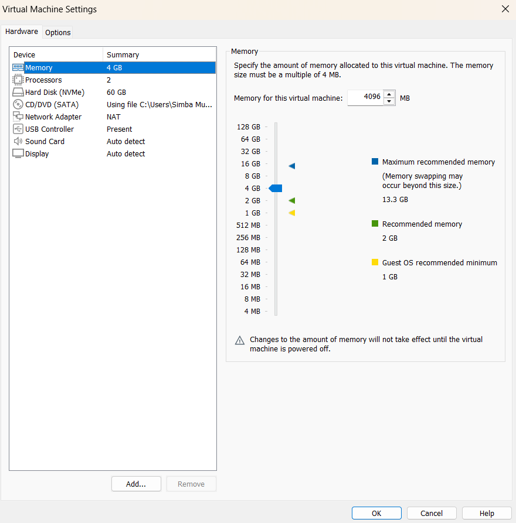
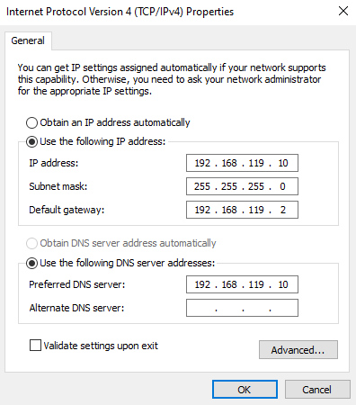
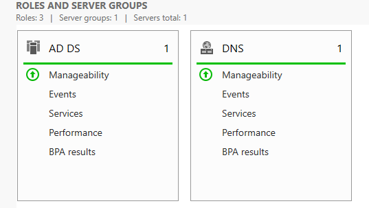
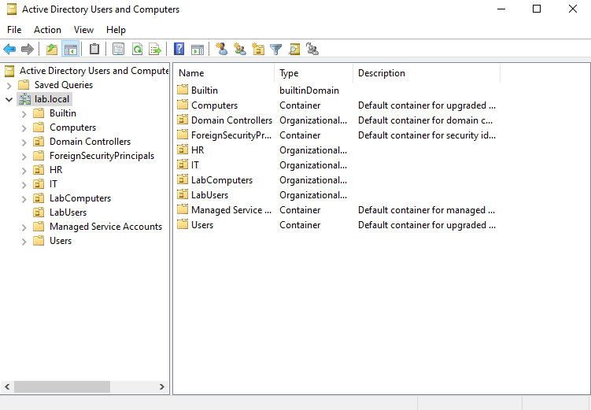
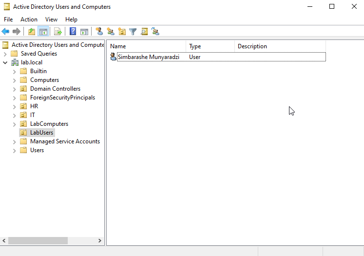
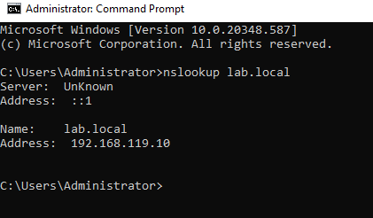
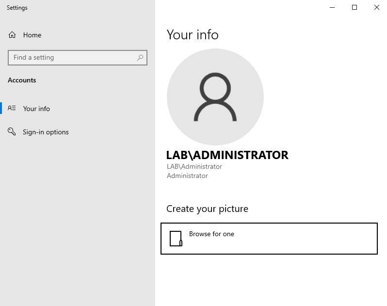
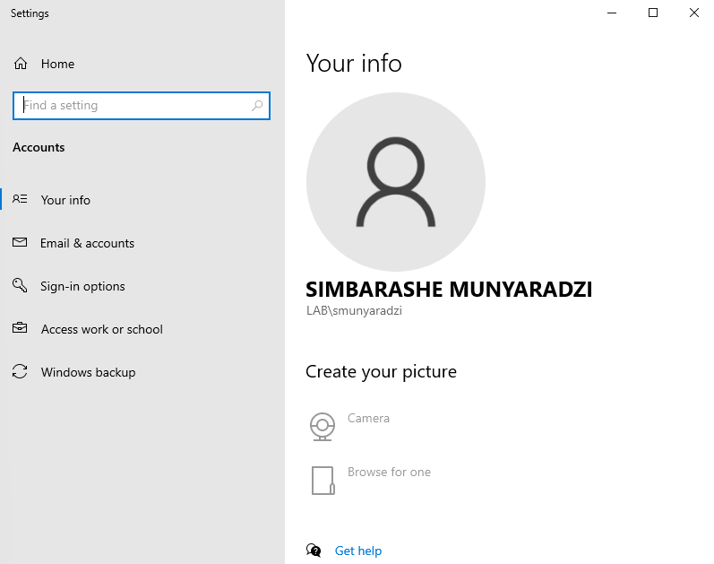
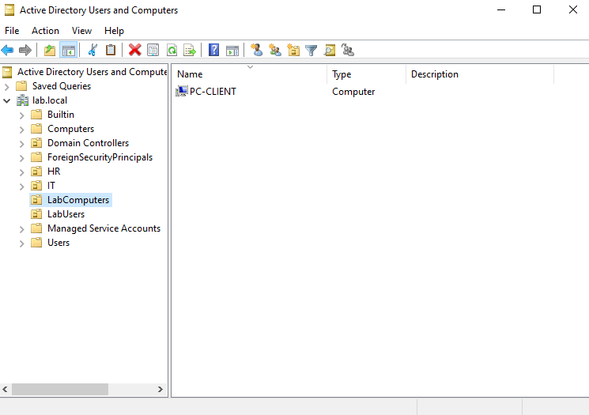

# Active Directory Home Lab – Windows Server 2022

## Project Overview

This project demonstrates the setup and configuration of a Windows Server 2022 Active Directory environment in a virtualized home lab. The lab includes installing Active Directory Domain Services (AD DS), configuring DNS, promoting a domain controller, designing Organizational Units (OUs), and managing users and computers according to best practices.

## Lab Objectives

- Build a virtualized Windows Server 2022 environment
- Configure static IP addressing and DNS
- Install and configure Active Directory Domain Services
- Promote a server to a Domain Controller
- Design a basic OU structure
- Create and manage domain users
- Verify AD functionality

## Environment & Tools

- Host OS: Windows 10/11
- Hypervisor: VMware Workstation
- Server OS: Windows Server 2022 (Evaluation)
- Hardware:
  - Processors: 2
  - RAM: 4 GB
  - Storage: 60 GB
- Networking: NAT (VMnet8)

## Network Configuration

The server is configured with a static IPv4 address to ensure stability for Active Directory and DNS services. NAT networking allows internet access while maintaining isolation from the host network.

**Key settings:**

- Static IP assigned within NAT subnet
- DNS configured to point to the server itself
- Gateway set to VMware NAT gateway

## Active Directory Installation

### Role Installation

- Installed Active Directory Domain Services using Server Manager
- Required features were added automatically by the wizard

### Domain Controller Promotion

- Created a new forest
- Root domain name: `lab.local`
- Forest & Domain Functional Level: Windows Server 2016
- DNS Server and Global Catalog enabled
- DNS delegation not configured (not required in lab environment)
- Directory Services Restore Mode (DSRM) password set

## Organizational Unit (OU) Design

Custom OUs were created to allow Group Policy application and proper administration:

- LabUsers
- LabComputers

**Reasoning:** Default AD containers cannot receive Group Policy Objects (GPOs). Custom OUs allow policy application and proper management.

## User Management

- Created test domain users (Simbarashe Munyaradzi) and placed them in the LabUsers OU
- Built-in system accounts were left in default containers to avoid system issues

## Verification & Testing

- Verified domain controller functionality via Active Directory Users and Computers
- Confirmed DNS resolution using `nslookup lab.local`
- Confirmed successful domain logon (`LAB\Administrator`)

## Challenges & Solutions

- **Challenge:** Server Manager continued to show a static IP warning after configuration
- **Solution:** Confirmed static IP using `ipconfig /all`. Warning safely ignored as it did not affect AD functionality

## Verification and Testing – Domain-Joined Client

This section verifies that the Windows client machine was successfully joined to the `lab.local` Active Directory domain and can authenticate using a domain user account.

### Domain User Login Verification

The screenshot below shows a successful login to the Windows client using a domain user account. This confirms that Active Directory authentication, DNS resolution, and the trust relationship between the client and the domain controller are functioning correctly.

### Client Computer Verification in Active Directory

The screenshot below confirms that the client computer object was automatically created in Active Directory and is visible within the appropriate Organizational Unit. This verifies that the domain controller recognizes and manages the client machine.

## Skills Demonstrated

- Windows Server 2022 administration
- Active Directory Domain Services (AD DS)
- DNS configuration and troubleshooting
- Virtualization (VMware)
- Network configuration (NAT, static IP)
- Organizational Unit design

## Next Steps

- Join Windows 10/11 client to the domain
- Configure Group Policy Objects (GPOs)
- Implement file server permissions
- Deploy a helpdesk ticketing system
